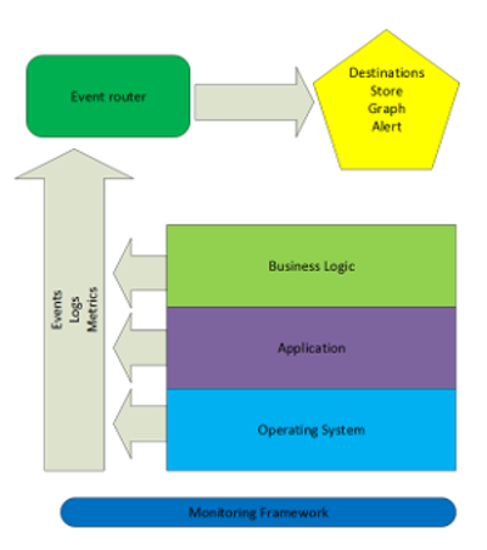

Why measure everything
================

---

Agenda
-------------------------------------------------------

* Why do we want to measure everything?
* Time series databases
* Push vs Pull
* Vanity metrics 
* Correlation of events 
* Q / A

---

Lean principles
-----------------------------------------------------

1. The principles of Flow

2. The principles of Feedback

3. The principles of Continuous Improvement and Experimentation

(source: The DevOps Handbook)

---

Peter Drucker
-----------------------------------------------------

*"What gets measured gets improved"*

---

telemetry stack
------------------------------

> Monitoring framework

(source: James Turnbull, the art of monitoring)

---

time series databases
----------------------------------------------------

A Time Series DBMS is a database management system that is optimized for handling time series data: each entry is associated with a timestamp.

Examples of prominent time series databases are: OpenTSDB, InfluxDB, Prometheus, Graphite, ...
Most of them are by design single node. (Although there is a clustered version of enterprise InfluxDB available)

---

metrics collection strategy
-----------------------------------------------------

(source: dataloop.io)

---

Push based
-----------------------------------------------------

multi-dimensional data

&nbsp;
> InfluDB

~~~~
h2o_feet,location=coyote_creek water_level=8.120,level\ description="between 6 and 9 feet" 1439856000
h2o_feet,location=coyote_creek water_level=8.005,level\ description="between 6 and 9 feet" 1439856360
h2o_feet,location=coyote_creek water_level=7.887,level\ description="between 6 and 9 feet" 1439856720
h2o_feet,location=coyote_creek water_level=7.762,level\ description="between 6 and 9 feet" 1439857080
~~~~

---

Pull based
-----------------------------------------------------

multi-dimensional data

&nbsp;
> Prometheus

~~~~
instance_cpu_time_ns{app="lion", proc="web", rev="34d0f99", env="prod", job="cluster-manager"}
instance_cpu_time_ns{app="elephant", proc="worker", rev="34d0f99", env="prod", job="cluster-manager"}
instance_cpu_time_ns{app="turtle", proc="api", rev="4d3a513", env="prod", job="cluster-manager"}
instance_cpu_time_ns{app="fox", proc="widget", rev="4d3a513", env="prod", job="cluster-manager"}
~~~~

---

Vanity Metrics vs. Actionable Metrics
-----------------------------------------------------

> Vanity metrics? Good to feel awesome. Bad for insights.

* number of Hits
* number of Downloads 
* number of Likes
* number of (insert anything here)

&nbsp;
&nbsp;

(source: Eric Ries)

---

Correlation of events from various systems
-----------------------------------------------------

(source: Ian Malpass, "Measure Anything, Measure Everything")

---

Q / A
----------------------------------------------

How are you measuring success? 

---
