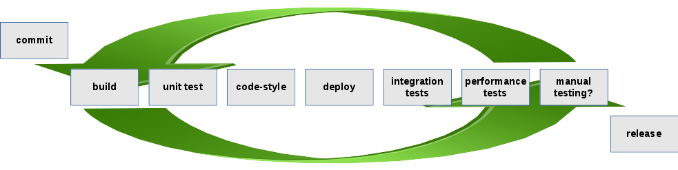

Lean development
================

---

Agenda
-------------------------------------------------------

* Inspirations
* Interview Questions
* Cars / Birds / Statistics / Switches
* Continuous Delivery
* Interview Answers
* Q / A

---

Some Inspirations (1/2)
-----------------------------------------------------

--

Some Inspirations (2/2)
-----------------------------------------------------

---

Engineering Leadership Interview Questions
-----------------------------------------------------

1. How do you deploy technology against a business strategy?

2. How do you address the dynamic nature of our priorities which can be constantly changed or modified?

3. Explain your decision making process when it comes to major technology investments

4. How do you stay current in terms of knowledge & skills in the face of an ever changing technology landscape?

(source: https://eoghan-nolan.squarespace.com/about/)

---

Why Lean Development?
-----------------------------------------------------

By following lean principles you will come to realize that this is the only way you will be able to deliver value to your clients in quality and time and on top give yourself a chance to innovate.

So where can I buy the tool? How much does it cost?

 > It's never about the tool!

---

Kata - Continuous Improvement
------------------------------

> The Andon Cord

---

Black Swan Theory
-----------------------------------------------------
> Nassim Nicholas Taleb

---

Simple Probability Theory
-----------------------------------------------------

Make it more likely to hit the jackpot by iterating faster.

---

Continuous Delivery
-----------------------------------------------------

Feature toggles and trunk based development --> Continuous Integration --> Continuous Delivery

---

Analyze Adoption
----------------------------------------------------

Go through an iterative cycle to deliver incremental changes to the customer (internal or external) and thoroughly analyze the adoption of the new feature.

> Further develop features that the customers like.

> At the same time tweak or abandon features that the customers do not like.

It's all about customer value creation and satisfaction.  

---

Delivery Pipeline
-----------------------------------------------------

> Visualize progress on each stage.
> Establish quality gates at each stage.
> Stop progress if a quality gate is not met!

* honor the test pyramid!
* reject or retain release candidates
* why not build your build environment before building?
* why not build your environment before deploying?

---

CD With Relational DBMSs
-----------------------------------------------------

0. Explain why you do all this
1. Properly source control any scripts
2. Build tooling around database deployments
3. Make deployments repeatable and idempotent
4. Separate configuration from code
5. Write DB unit test
6. Integrate with CI tool of choice
7. Write e2e integration tests
8. Combine with data virtualization technology

0. Explain why you do all this

> and btw. did I mention it's not about the tool?

Note:
 Yes, they are still in use... Often DB changes are rolled out manually by the developer or by an environment management team. Environments are in an inconsistent state.

---

Interview Answers
-----------------------------------------------------

1. How do you deploy technology against a business strategy?
  > By applying lean principles
2. How do you address the dynamic nature of our priorities which can be constantly changed or modified?
  > By applying lean principles
3. Explain your decision making process when it comes to major technology investments
  > PoC technology applying lean principles
4. How do you stay current in terms of knowledge & skills in the face of an ever changing technology landscape?
  > By attending meetup presentations

---

Q / A
----------------------------------------------

And when do you adopt Continuous Delivery & Lean Development?

---
